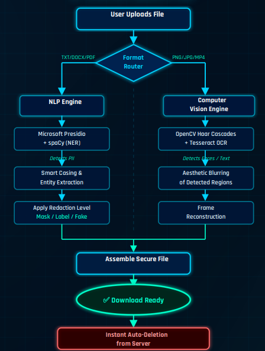

# 🔐 REDACTIFY
### Intelligent Redaction & Anonymization Tool

> **REDACTIFY** is an intelligent, privacy-focused tool designed to detect and anonymize sensitive information from text, documents, images, and videos while providing multiple levels of redaction based on the required privacy level.

---

## 🎯 Project Overview

In today's digital world, sensitive information such as **names, email addresses, phone numbers, Aadhaar numbers, PAN numbers, and other Personally Identifiable Information (PII)** can be exposed when documents or media files are shared.

**REDACTIFY** helps protect sensitive information by automatically detecting private data and applying suitable redaction techniques.

The system provides **three levels of redaction**, allowing users to choose the desired level of privacy while processing their files.

---

## ✨ Key Features

### 🔍 Sensitive Information Detection

- Detects Personally Identifiable Information (PII)
- Email addresses
- Phone numbers
- Aadhaar numbers
- PAN numbers
- Names and other entities
- Sensitive text and regions in images and videos

### 🔐 Multiple Redaction Levels

- **Low Level** – Masks sensitive information using `X`
- **Medium Level** – Replaces sensitive information with anonymized tokens such as `EMAIL_1`
- **High Level** – Replaces sensitive information with realistic synthetic data

### 📄 Document Processing

- Text processing
- PDF processing
- Sensitive information extraction
- Automated redaction

### 🖼️ Image Processing

- Detects sensitive text and regions in images
- OCR-based text detection
- Automatically redacts detected information
- Generates protected output

### 🎥 Video Processing

- Frame-based processing
- Detection of sensitive text and regions
- Redaction across video frames
- Reconstruction of the processed video

### 📊 Redaction Reporting

- Tracks detected sensitive information
- Provides a summary of redacted content
- Helps users understand what information was protected

### 🛡️ Privacy-Focused Processing

- Secure file processing
- Temporary file handling
- Temporary processing data is removed after processing

---

# 🧠 How REDACTIFY Works

REDACTIFY uses different processing pipelines depending on the type of file uploaded.

```text
                    ┌─────────────────────┐
                    │   User Uploads File │
                    │  Text / PDF / Image  │
                    │       / Video       │
                    └──────────┬──────────┘
                               │
                               ▼
                    ┌─────────────────────┐
                    │    Format Router    │
                    └──────────┬──────────┘
                               │
                 ┌─────────────┴─────────────┐
                 │                           │
                 ▼                           ▼
        ┌─────────────────┐         ┌────────────────────┐
        │   NLP Engine    │         │ Computer Vision    │
        │                 │         │      Engine        │
        └────────┬────────┘         └─────────┬──────────┘
                 │                            │
                 ▼                            ▼
        ┌─────────────────┐         ┌────────────────────┐
        │ PII / Entity    │         │ Image / Text /     │
        │ Detection       │         │ Region Detection   │
        └────────┬────────┘         └─────────┬──────────┘
                 │                            │
                 └─────────────┬──────────────┘
                               │
                               ▼
                    ┌─────────────────────┐
                    │  Redaction Level   │
                    │   Low / Medium /   │
                    │       High         │
                    └──────────┬──────────┘
                               │
                               ▼
                    ┌─────────────────────┐
                    │  Redacted Output   │
                    │   File Generation   │
                    └─────────────────────┘

```
🔄 System Workflow

The following workflow illustrates how REDACTIFY processes uploaded files, detects sensitive information, applies the selected redaction level, and generates the final protected output.

📌 Workflow Diagram
<p align="center">  </p>
Workflow Steps

1. 📤 User Uploads File

The user uploads a supported text, document, image, or video file.

2. 🔀 Format Router

The system identifies the uploaded file format and sends it to the appropriate processing pipeline.

3. 🧠 NLP Engine

Text-based files are processed using NLP techniques to identify sensitive entities and PII.

4. 👁️ Computer Vision Engine

Images and video frames are processed using computer vision and OCR techniques to identify sensitive regions and text.

5. 🔍 Sensitive Information Detection

The system detects sensitive entities, text, and regions that need to be protected.

6. ✂️ Redaction Level Application

The selected redaction level is applied using:

Character masking
Token replacement
Synthetic data replacement

7. 📦 Secure File Assembly

The processed content is reconstructed into the final output file.

8. 📥 Redacted File Ready

The protected file is made available for the user.

9. 🗑️ Temporary Data Deletion

Temporary processing data is removed after processing to improve privacy and security.

🔐 Redaction Levels

REDACTIFY provides three levels of anonymization depending on the required privacy level.

Level	Method	Example
🟢 Low	Character Masking	XXXXXXXXXX
🟡 Medium	Token Replacement	EMAIL_1
🔴 High	Synthetic Data	alex.john@example.com
🟢 Level 1 — Low Redaction

Sensitive information is completely masked using characters such as X.

Example

Original:

Name: Harshitha S
Email: example@gmail.com
Phone: 9876543210

Low Redaction:

Name: XXXXXXXXX
Email: XXXXXXXXX
Phone: XXXXXXXXXX
🟡 Level 2 — Medium Redaction

Sensitive information is replaced with identifiable but anonymized tokens.

Example
Name: PERSON_1
Email: EMAIL_1
Phone: PHONE_1

This preserves the structure of the information while hiding the actual sensitive values.

🔴 Level 3 — High Redaction

Sensitive information is replaced with realistic synthetic data.

Example
Name: Emily Carter
Email: emily.carter@example.com
Phone: 9123456780

Synthetic values are generated to maintain realistic-looking data without exposing the original information.

🛠️ Technologies Used

Technology	Purpose
🐍 Python	Core application development
🧠 Microsoft Presidio	PII detection and anonymization
🧠 spaCy	Named Entity Recognition (NER)
🎭 Faker	Synthetic data generation
📊 Pandas	Data processing
👁️ OpenCV	Image and video processing
🔎 Tesseract OCR	Text extraction from images
📄 PyMuPDF	PDF processing
🌐 HTML / CSS / JavaScript	Frontend interface
🔐 Regular Expressions	Pattern-based sensitive data detection

🏗️ Project Structure

REDACTIFY/
│
├── backend/
│   ├── app.py
│   ├── file_processor.py
│   ├── redactor.py
│   ├── security_manager.py
│   └── requirements.txt
│
├── frontend/
│   └── index.html
│
├── assets/
│   └── system-workflow.png
│
├── .gitignore
│
└── README.md

🎥 Project Demo

### 🎬 Demo

[▶️ Watch the REDACTIFY Demo](assets/demo.mp4)

📌 Project Highlights
🔐 Privacy-focused data anonymization
🧠 AI/NLP-based sensitive information detection
🎚️ Three levels of redaction
📄 PDF and document processing
🖼️ Image processing
🎥 Video frame processing
🔎 OCR-based text detection
🎭 Synthetic data generation
📊 Redaction reporting
🌐 Web-based interface
🛡️ Secure temporary file handling

# 👥 Team Members

| Team Member | LinkedIn |
|------------|----------|
| **Harshitha S** | https://www.linkedin.com/in/harshitha-s-261244413/ |
| **Bavyashree T** | https://www.linkedin.com/in/bavyashree-t-127374422/ |
